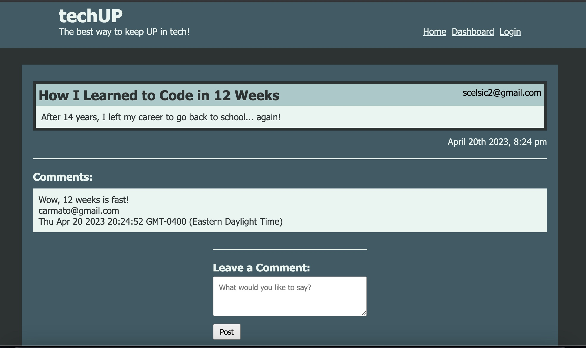

# TechUP

## Description

TechUP is the tech blog that offers the best way to keep up on tech!  Read, post, and comment!  Meet others in the tech industry with similar interests.

## Usage

Login.

Use your dashboard to view any posts you've made or create a new post.

View all blog posts.

Make a comment on a post.

## Credits

- https://www.w3schools.com/tags/tag_a.asp
- https://www.npmjs.com/package//nodemon
- https://www.w3schools.com/css/css_link.asp
- https://css-tricks.com/snippets/css/a-guide-to-flexbox/
- https://colorhunt.co/palette/2c3333395b64a5c9cae7f6f2
- https://www.w3schools.com/css/css3_variables.asp
- https://sequelize.org/docs/v7/other-topics/other-data-types/
- https://www.w3schools.com/tags/att_textarea_maxlength.asp
- https://www.youtube.com/watch?v=hKYjSgyCd60
- https://github.com/jdtdesigns/basic_mvc_auth_example
- https://www.w3schools.com/howto/howto_css_form_icon.asp
- https://www.npmjs.com/package/moment
- https://css-tricks.com/examples/BoxSizing/
- tutoring 24APR2023
- office hours 25APR2023

## License

MIT License

## Deployed Application Link

https://boiling-gorge-97887.herokuapp.com/